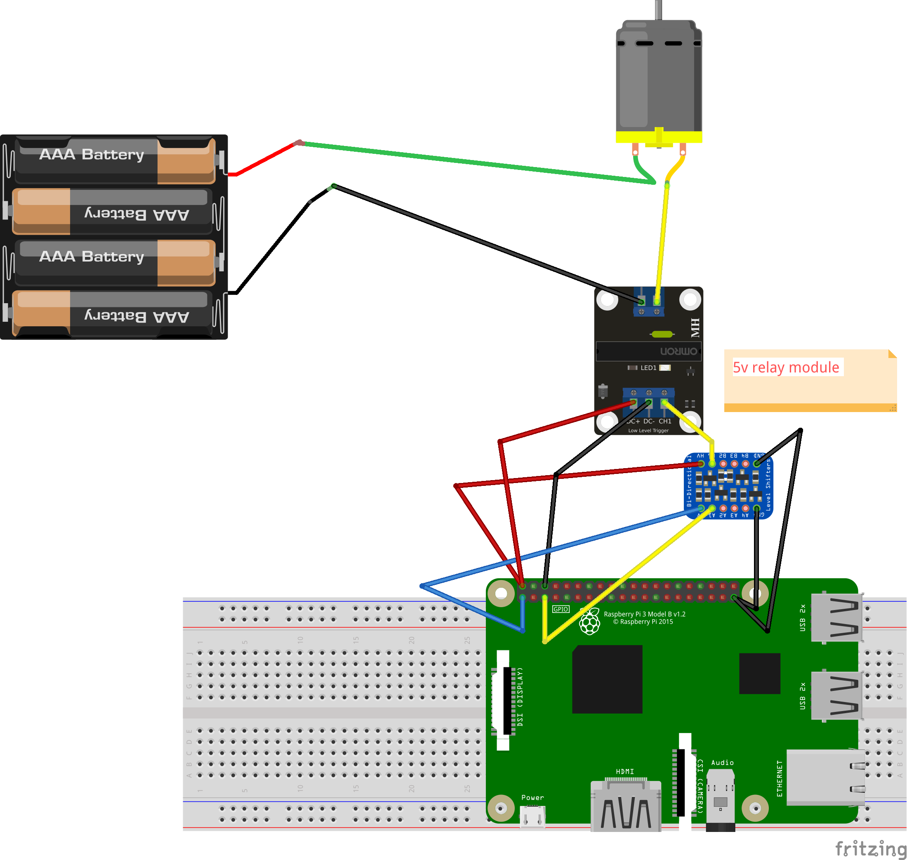

# QR Code Based Vending Machine

## Table of Contents

- [About](#about)
- [Getting Started](#getting_started)
- [Usage](#usage)
- [WebApp Links](#webapp)
- [Circuit Diagram](#circuit)
- [QR Code](#qr)
- [Demo Videos](#videos)

## About <a name = "about"></a>

This repository contains Backend, User WebApp, Admin Dashboard and Python Firmware for Raspberry Pi

## Getting Started <a name = "getting_started"></a>

These instructions will get you a copy of the project up and running on you raspberry pi.

### Prerequisites

Turn on your Raspberry Pi, copy Firmware folder to the destkop of your Raspberry Pi and execute the following commands

```
- sudo apt update
- sudo apt upgrade

```

### Installing

Installing the Firmware to your Raspberry Pi

This assumes that you have already copied Firmware folder from this repository to the desktop of your Raspberry Pi
Open the terminal and execute the following commands

```
- cd ~/Desktop/Firmware
- python3 mainHandle.py
```


## Usage <a name = "usage"></a>

- Run the Raspberry Pi Firmware
- Scan the QRCode or open this link on your device
- http://vend-frontend.production.wrapdrive.tech/#/dashboard
- Click VEND button to vend the product

- For vend reports open the admin panel
- http://vend-admin.production.wrapdrive.tech/#/main

```
Default email address: admin@admin.com
Default password: admin
```

## WebApp Links <a name = "webapp"></a>

- Client App Machine 1 http://vend-frontend.production.wrapdrive.tech/#/dashboard/1
- Client App Machine 2 http://vend-frontend.production.wrapdrive.tech/#/dashboard/2
- Admin Dashboard http://vend-admin.production.wrapdrive.tech/#/

## Circuit Diagram <a name = "circuit"></a>
Servo is connected to GPIO3 of Raspberry Pi



## QRCode <a name = "qr"></a>
- On scanning,it will lead to Client Machine Links
    Machine 1
    
    Machine 2
    

## Demo Videos <a name = "videos"></a>

- Admin Dashboard with reports: https://youtu.be/Xk8GflYM__A
- User Flow: https://youtu.be/5QvsIMGCAJA